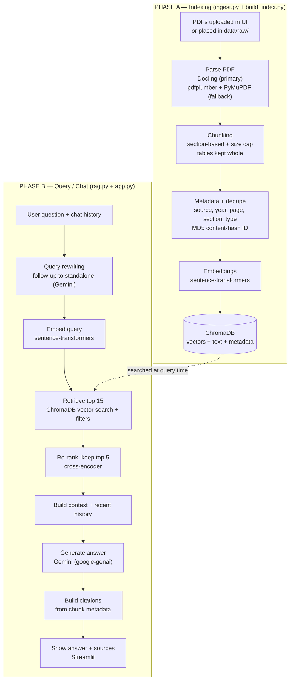

# Project Workflow & Library Reference
 
A revision guide for the **Conversational PDF RAG Chatbot**. It explains the
end-to-end flow, where each piece lives in the code, and what every library is
doing and why.
 
---
 
## The big picture
 
The system has **two phases** that run at different times:
 
- **Phase A – Indexing** (done once per document set; can run offline): turn PDFs
  into searchable vectors.
- **Phase B – Query / Chat** (every question): find the right chunks and let the
  LLM answer using only them.
 

 
---
 
## Phase A — Indexing, step by step
 
| Step | What happens | File · function |
|------|--------------|-----------------|
| Upload | PDFs saved to `data/raw/` | `app.py` (file uploader) |
| Parse | Docling extracts text/tables/headings in reading order with page numbers; if Docling is unavailable, pdfplumber + PyMuPDF take over | `ingest.py` · `parse_with_docling`, `parse_with_fallback` |
| Chunk | Consecutive text grouped per section; flushed when the heading changes or `CHUNK_CHAR_LIMIT` (1200) is hit; tables emitted whole | `ingest.py` · `items_to_chunks` |
| Metadata | Each chunk tagged with source file, year (from filename), page, section, chunk type | `ingest.py` · `build_chunk`, `detect_year` |
| Dedupe | Chunk ID = MD5 of its content, so re-runs never duplicate | `ingest.py` · `make_chunk_id`, `dedupe` |
| Embed | Each chunk's text turned into a vector | `build_index.py` · `index_chunks` |
| Store | Vectors + text + metadata written to ChromaDB (cosine space, upsert) | `build_index.py` · `index_chunks` |
 
## Phase B — Query / Chat, step by step
 
| Step | What happens | File · function |
|------|--------------|-----------------|
| Rewrite | A follow-up ("does it change after 5 years?") is rewritten into a standalone question using the chat history | `rag.py` · `rewrite_query` |
| Embed query | The standalone question becomes a vector | `rag.py` · `retrieve` → `get_embedder` |
| Retrieve | ChromaDB returns the top 15 nearest chunks (optional year/file/type filters) | `rag.py` · `retrieve`, `_build_where` |
| Re-rank | Cross-encoder re-scores all 15 against the query; best 5 kept | `rag.py` · `rerank` |
| Context | Top chunks + recent conversation turns assembled into the prompt | `rag.py` · `build_context`, `answer` |
| Answer | Gemini answers using only that context | `rag.py` · `_ask_gemini`, `get_gemini` |
| Cite | Citations built from chunk metadata (not the LLM, so they can't be faked) | `rag.py` · `build_citations` |
| Display | Answer + expandable sources + retrieved chunks shown | `app.py` |
 
---
 
## Library reference
 
| Library | What it is | Key features used | Where in the project |
|---------|-----------|-------------------|----------------------|
| **Streamlit** | Web UI framework for Python | `file_uploader`, `chat_input`, `chat_message`, `session_state` (chat memory), `spinner`, `sidebar`, filters | `app.py` |
| **Docling** | Layout-aware document parser | `DocumentConverter`, `PdfPipelineOptions` (`artifacts_path` for offline, `do_table_structure`, `do_ocr`), `iterate_items`, `export_to_markdown` | `ingest.py` · `parse_with_docling` |
| **pdfplumber** | PDF text + table extractor | `extract_text()`, `extract_tables()` | `ingest.py` · `parse_with_fallback` |
| **PyMuPDF (fitz)** | Fast PDF reader | `open()`, `get_text()` as a text safety-net when pdfplumber returns nothing | `ingest.py` · `parse_with_fallback` |
| **sentence-transformers** | Embedding + cross-encoder models | `SentenceTransformer` (turns text into vectors), `CrossEncoder` (re-ranking) | `build_index.py`, `rag.py` |
| **PyTorch** | Deep-learning backend | Runs the transformer models above (used implicitly) | via sentence-transformers |
| **ChromaDB** | Local vector database | `PersistentClient`, `get_or_create_collection` (cosine), `upsert`, `query` (`query_embeddings`, `n_results`, `where` filters) | `build_index.py`, `rag.py` |
| **google-genai** | Current Gemini SDK | `genai.Client`, `client.models.generate_content` for query rewriting + answers | `rag.py` · `get_gemini`, `_ask_gemini` |
| **huggingface-hub** | Model downloader | `snapshot_download` to pre-fetch models for offline use | `download_models.py` |
| **python-dotenv** | Loads `.env` | `load_dotenv()` so settings/keys come from `.env` | `config.py` |
| **hashlib / re / json** | Python standard library | MD5 chunk IDs · year regex · saving chunks to disk | `ingest.py`, `build_index.py` |
 
---
 
## Design decisions worth knowing (for interviews)
 
- **Two retrievers, not one.** A fast vector search (ChromaDB) casts a wide net of
  15 candidates; a slower but more accurate cross-encoder then re-ranks to the
  best 5. This bi-encoder + cross-encoder combo is the standard accuracy trick.
- **Citations come from metadata, never from the LLM** — so sources can't be
  hallucinated and always trace back to a real page.
- **Conversation-aware retrieval.** Query rewriting turns follow-ups into
  standalone questions before searching, so "it" / "that" resolve correctly.
- **Section-based chunking with tables kept whole** keeps each chunk topically
  coherent; there is intentionally no sliding overlap (boundaries follow
  headings instead).
- **Offline by design.** Models load from local folders, so parsing, embedding,
  and retrieval need no internet — only Gemini's answer step does.
- **Idempotent ingestion.** Content-hash IDs mean re-running never creates
  duplicate chunks.
 
## One-paragraph summary (the elevator pitch)
 
> This is a conversational RAG chatbot over internal PDFs. Docling parses each
> PDF into layout-aware, metadata-rich chunks (with pdfplumber/PyMuPDF as a
> fallback), which are embedded with a HuggingFace sentence-transformer and
> stored in ChromaDB. At query time, the user's follow-up is rewritten into a
> standalone question, ChromaDB retrieves candidate chunks, a cross-encoder
> re-ranks them, and Gemini generates a grounded answer with citations built
> from chunk metadata. The UI is Streamlit, and all models can run offline.
 